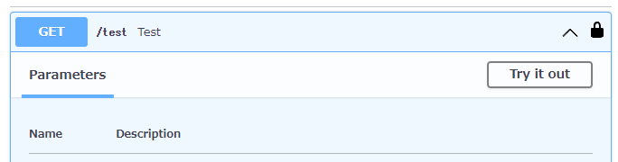

# cognito_test

AWS Cognitoから取得したJWTトークンを検証するサンプル

1.署名の検証  
2.有効期限(exp)，オーディエンス(aud)，発行者(iss)，トークン使用用途(token_use)の検証

参考:https://docs.aws.amazon.com/ja_jp/cognito/latest/developerguide/amazon-cognito-user-pools-using-tokens-verifying-a-jwt.html

## 起動方法
docker-composeが使える環境で`docker-compose up --build`

## テスト方法
1. ターミナル上に，トークンが出力されるのでコピーする  

2. ブラウザで，http://localhost:8080/docs にアクセスし，SwaggerUIを表示する  

3. SwaggerUI上で，Authorizeボタンを押下する  

4. トークンを入力し，Authorizeボタンの横にある「Authorize」ボタンを押下する  
このとき，`Bearer <token>` と入力する  

5. GET /test を Try it out で実行する  

6. トークンが有効な場合，200が返ってくる  
